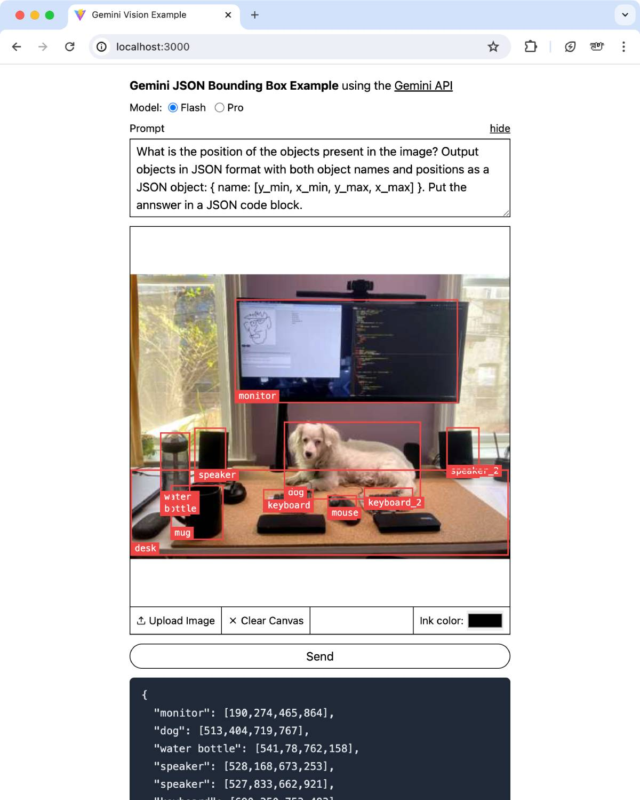

# Gemini JSON bounding box example

An example front-end for how to prompt and then display bounding box info from the Gemini API.

## Normalization

If you're looking to make your own application. Keep in mind that gemini returns coordinates normalize to 1000x1000. It also better when using the coordinate order in the example prompt. See BoundingBoxOverlay.tsx for an example of how to transform these for use in HTML and javascript.

## More examples

A fancier example is available at https://github.com/GrantCuster/gemini-spatial-example.

## Running

Put your Gemini API Key (get from https://ai.google.dev/) into the `example.env` file and rename to `.env`. Use `npm install` and `npm run dev` to run locally.
